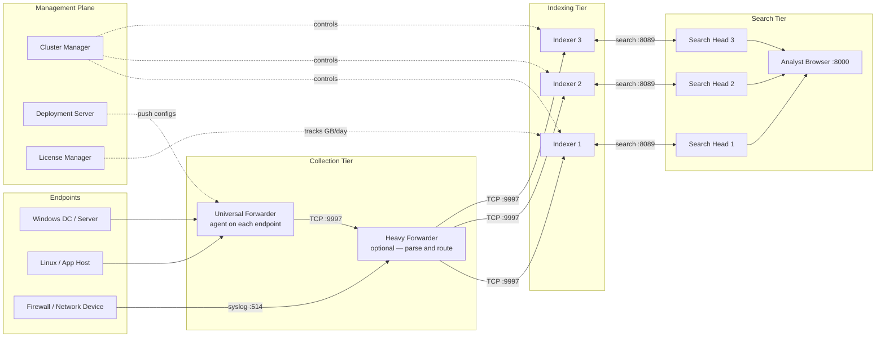
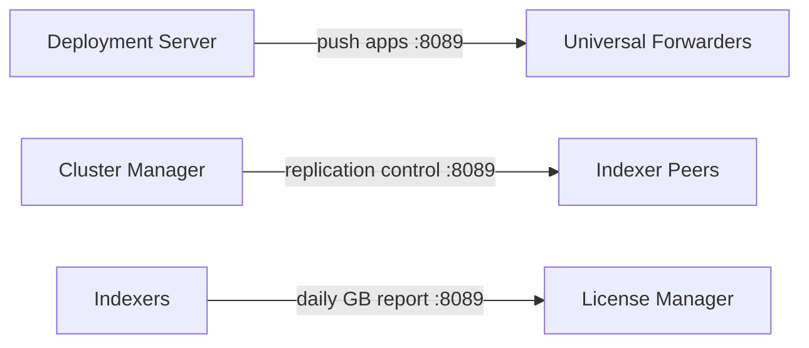
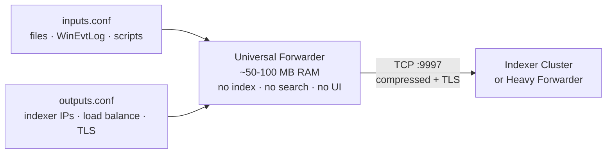
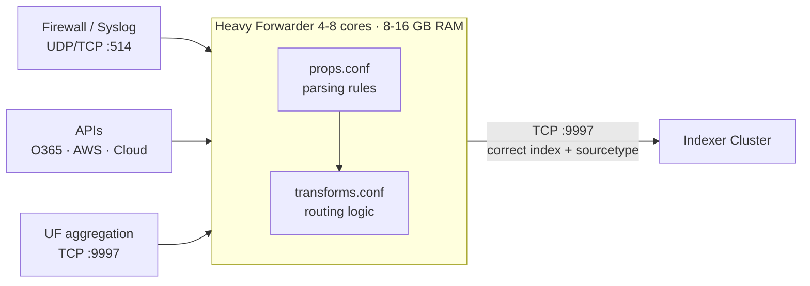
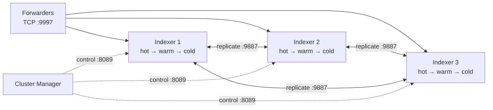
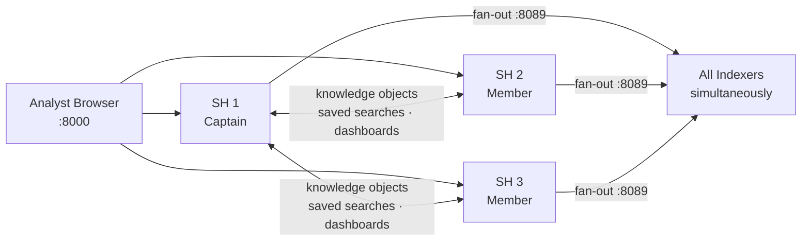
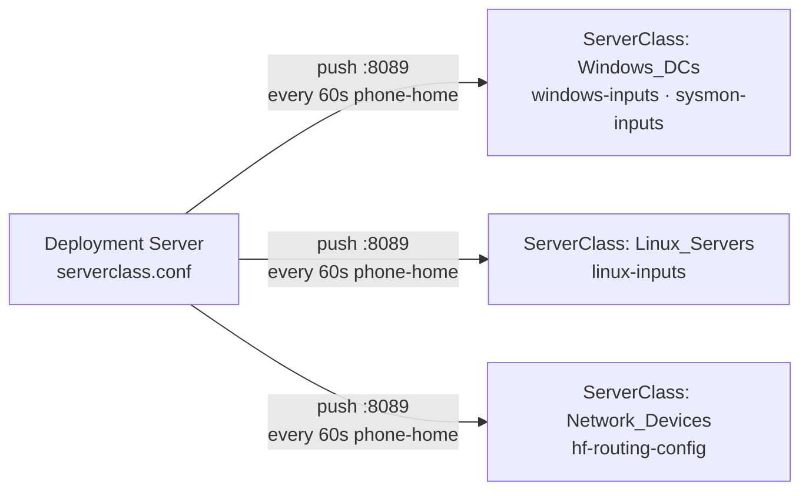
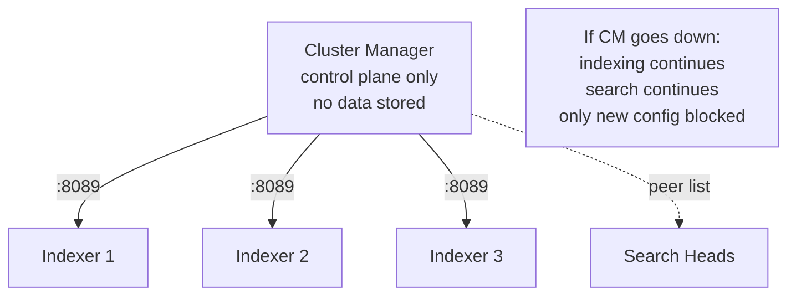
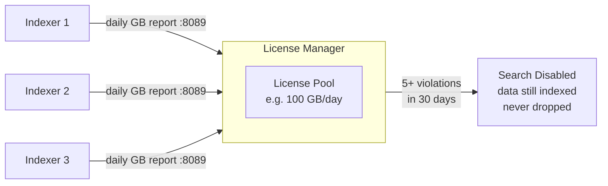

# 01 · Distributed Architecture — Big Picture

> **Core question this module answers:** Why does distributed Splunk exist, what are its 7 components, and how do they all connect?

---

## Official Sources

> Every fact in this module is sourced and cross-referenced from official Splunk documentation.

| Document | What it covers | Link |
|----------|----------------|------|
| Types of Distributed Deployments | Deployment sizes (departmental → large enterprise) and which components each requires | [Deploymentcharacteristics](https://docs.splunk.com/Documentation/Splunk/9.3.0/Deploy/Deploymentcharacteristics) |
| Start Implementing Distributed Deployment | Installation order, component roles, production overview | [Implementationoverview](https://docs.splunk.com/Documentation/Splunk/9.4.2/Deploy/Implementationoverview) |
| SVA C1/C11 — Single-Site Clustered | The official Splunk Validated Architecture this module's topology is based on | [SVA C1C11](https://docs.splunk.com/Documentation/SVA/current/Architectures/C1C11) |
| About Splunk Validated Architectures | What SVAs are, why to use them, how they are structured | [About SVA](https://help.splunk.com/en/splunk-cloud-platform/splunk-validated-architectures/introduction-to-splunk-validated-architectures/about-splunk-validated-architectures) |
| High Availability: Indexer Cluster | Indexer clustering, replication factor, search factor, peer roles | [Indexercluster](https://docs.splunk.com/Documentation/Splunk/9.4.2/Deploy/Indexercluster) |
| Basics of Indexer Cluster Architecture | Manager node, peer nodes, bucket replication deep dive | [Basicclusterarchitecture](https://docs.splunk.com/Documentation/Splunk/9.4.2/Indexer/Basicclusterarchitecture) |
| Medium-Large Enterprise: SHC with Indexers | Integrating a Search Head Cluster with an Indexer Cluster end-to-end | [SHCwithindexers](https://docs.splunk.com/Documentation/Splunk/9.4.2/Deploy/SHCwithindexers) |
| Deploy a Search Head Cluster | SHC deployment, Captain election, deployer role | [SHCdeploymentoverview](https://docs.splunk.com/Documentation/Splunk/9.4.0/DistSearch/SHCdeploymentoverview) |
| Deployment Server Architecture | How DS communicates with and manages the forwarder fleet, server classes | [Deploymentserverarchitecture](https://docs.splunk.com/Documentation/Splunk/9.4.2/Updating/Deploymentserverarchitecture) |

---

## Architecture Diagram

---

## Why Distributed? The Single-Instance Problem

A single-instance Splunk deployment puts everything on one machine: receive → parse → index → store → search → serve UI.

**This breaks at enterprise scale for three reasons:**

| Problem | What Happens | SOC Impact |
|---------|-------------|------------|
| **Resource contention** | A 30-day threat hunt competes with live ingestion for the same CPU/RAM | Logs drop during investigations — blind spots exactly when you need visibility most |
| **Single point of failure** | One box goes down = complete loss of log collection and search | Your SIEM going dark during an attack is a worst-case scenario |
| **No horizontal scale** | Can't add a second identical server — no native clustering | Storage, ingest rate, and search all hit a ceiling at the same time |

**Distributed Splunk** separates concerns — each function runs on dedicated hardware, scaled independently, with redundancy at every tier.

---

## Full Architecture Topology

---

## Data Plane vs. Management Plane

> **This distinction is critical** for HA planning, firewall rules, and cert exams. When a SOC analyst reports missing data, the first question is: which plane has the fault? They are completely separate failure domains.

### Data Plane — where logs actually flow

### Management Plane — where config and control flow

---

## The 7 Roles

| Role | One Job | Tier | Own Box? | Resource Profile |
|------|---------|------|----------|-----------------|
| Universal Forwarder | Collect logs on endpoint, compress + TLS, ship out. Nothing else. | Collection | No — co-located on endpoint | ~50-100 MB RAM, negligible CPU |
| Heavy Forwarder | Parse, filter, and route logs before indexing. Handles syslog and API pulls. | Collection | Yes — dedicated box | 4-8 CPU cores, 8-16 GB RAM |
| Indexer | Receive events, parse, write to disk buckets, replicate, serve search results. | Indexing | Yes — one box per peer | 12-16 cores, 32-64 GB RAM, NVMe SSD |
| Cluster Manager | Control the indexer cluster: replication, peer health, rolling restarts. | Management | Shares with License Manager | 4 cores, 8 GB RAM |
| Search Head | Accept analyst queries, fan out to all indexers, merge and render results. | Search | Yes — one box per member | 8-16 cores, 16-32 GB RAM |
| Deployment Server | Push config apps to every forwarder in the fleet on phone-home. | Management | Shares with Cluster Manager | 4 cores, 8 GB RAM |
| License Manager | Track GB/day indexed against the license cap. | Management | Shares with Cluster Manager | Minimal — shares box |

---

## Component Deep Dives

### Universal Forwarder (UF)

Stripped-down binary — no web UI, no search engine, no index. Its only jobs: **monitor → compress → encrypt → ship.**

**What it can monitor:**
- Files and directories (tail mode)
- Windows Event Log (System, Security, Application, custom channels)
- Windows Registry changes
- Network ports (receive TCP/UDP data)
- Scripted inputs (run a script, capture stdout as events)

**What it CANNOT do:**
- Parse syslog or CEF/LEEF formats
- Route events to different indexes based on content
- Apply transforms or field extractions
- Run SPL searches

**Key config files:** `inputs.conf` (what to monitor), `outputs.conf` (where to send)
**Resource footprint:** ~50-100 MB RAM, negligible CPU. Safe to run on DCs, SQL servers, POS terminals.
**Deployment at scale:** Managed via Deployment Server — never SSH into individual UFs to update config.

---

### Heavy Forwarder (HF)

A full Splunk instance configured NOT to store data locally. You deploy 1-4 HFs per environment as centralized collection and routing points.

**When you need a HF instead of a UF:**
- Firewall sends syslog over UDP 514 — UFs can't receive raw syslog, HFs can
- You need to route `pan:traffic` to a `firewall` index and `pan:threat` to a `threats` index
- Pulling from an API (Office 365 audit logs, AWS CloudTrail)
- Receiving CEF/LEEF that needs parsing before indexing

**Key config files:** `inputs.conf`, `props.conf` (parsing rules), `transforms.conf` (routing), `outputs.conf`
**Resource profile:** 4-8 CPU cores, 8-16 GB RAM — higher than UF because it does real parsing work.

---

### Indexer & Indexer Cluster

Every event that enters Splunk lands on an indexer. It is the core storage engine.

**What happens to incoming data:**
1. Receives raw data stream on TCP 9997
2. Parses into discrete events (line breaking, timestamp extraction)
3. Extracts default fields: `_time`, `host`, `source`, `sourcetype`, `index`
4. Writes to **hot buckets** on local disk
5. Builds an inverted index for fast text search
6. Replicates buckets to peer indexers

**Bucket lifecycle:**
- **Hot** — actively written, searchable, NVMe/SSD required
- **Warm** — closed for writing, searchable, SSD acceptable
- **Cold** — older data, searchable but slower, HDD/NAS acceptable
- **Frozen** — archived off-disk, not searchable
- **Thawed** — manually restored frozen data for investigation

**Resource profile:** 12-16 CPU cores, 32-64 GB RAM, NVMe SSD for hot/warm.

---

### Search Head Cluster (SHC)

Browser connects to port 8000 on a Search Head. **The SH stores no event data** — only knowledge objects.

**How a search executes:**
1. Analyst submits SPL in the browser
2. Search Head compiles the SPL
3. Dispatches the job to **every indexer simultaneously** via port 8089
4. Each indexer searches its local buckets and streams partial results back
5. Search Head **merges, sorts, deduplicates** all partial results
6. Renders the final output in the UI

**In a Search Head Cluster (SHC):** 3+ SHs share knowledge objects. A Captain is elected via Raft consensus. If one SH dies, analysts connect to another automatically.
**Resource profile:** 8-16 CPU cores, 16-32 GB RAM.

---

### Deployment Server (DS)

At enterprise scale you have 2,000+ UFs. You don't SSH into each one to update `inputs.conf`.

**How it works:**
- UFs **phone home** every 60 seconds
- You create **Deployment Apps** (folders with config files)
- You assign apps to **Server Classes** (groups: "all Windows DCs", "all Linux web servers")
- On phone-home, DS pushes updated apps to all matching UFs

**Key config file:** `serverclass.conf`
**Important limit:** Manages forwarders only — not indexers, not search heads. Those use different mechanisms.

---

### Cluster Manager (CM)

Does NOT index or store data. Controls the indexer cluster only.

**What it manages:** peer health, bucket replication, rolling restarts, and tells Search Heads which peers to query.

**Critical HA fact:** If the Cluster Manager goes down, **indexing and search continue uninterrupted.** Replication can't self-heal and config changes can't propagate — but data flow is unaffected. This is intentional by design.

Typically co-located with the License Manager.

---

### License Manager (LM)

**Violation behavior:**
- Exceeding the daily limit triggers a **warning** (not a hard stop)
- Data continues to be indexed — **never dropped**
- **5+ violations in 30 days** → search is disabled until resolved
- Indexing continues even when search is blocked

Typically co-located with the Cluster Manager.

---

## Hardware Placement Guide

| Role | Dedicated Box? | Why |
|------|---------------|-----|
| Universal Forwarder | No — runs on endpoint | Deliberately lightweight, designed to co-exist with host workloads |
| Heavy Forwarder | Yes | Handles syslog storms and API polling — needs dedicated resources |
| Indexer (each peer) | Yes | Disk I/O intensive — sharing with search causes mutual degradation |
| Search Head (each member) | Yes | Memory intensive for result merging across concurrent analyst searches |
| Cluster Manager | Shares with License Manager | Only processes control signals — no data, minimal CPU/RAM needed |
| Deployment Server | Shares with Cluster Manager | Config distribution is not compute-heavy |
| License Manager | Shares with Cluster Manager | Just aggregates daily GB reports from indexers — minimal workload |

---

## Self-Check Questions

**Q1 — Can a UF parse syslog from a Cisco ASA and route it to the firewall index?**
No. A Universal Forwarder has no parsing engine. It cannot parse CEF/LEEF/syslog formats or make routing decisions. You need a **Heavy Forwarder** to receive raw syslog on UDP/TCP 514, apply `props.conf` parsing rules, and route via `transforms.conf` to the correct index.

**Q2 — If the Cluster Manager crashes, do searches stop? Does ingestion stop?**
Neither stops. Indexers continue running and serving search requests. Search Heads continue dispatching queries. The only impact is that new config changes can't propagate to peers, and bucket replication can't self-heal from peer failures. Data flows continue uninterrupted.

**Q3 — Where are search results merged after fan-out to all indexers?**
On the **Search Head.** It fans out the SPL to all indexers simultaneously, each indexer streams partial results back, and the SH merges, sorts, deduplicates, and renders the final output. The indexers never communicate with each other during a search.

**Q4 — You have 2,000 Windows UFs and need to push an updated inputs.conf. What handles this?**
The **Deployment Server.** Update the Deployment App containing `inputs.conf`, and when UFs phone home on their 60-second interval, the DS pushes the updated app to all matching Server Class members. No SSH, no manual touches to individual hosts.

---

*Next: [02a · Universal Forwarder (UF)](02a-universal-forwarder.md)*
