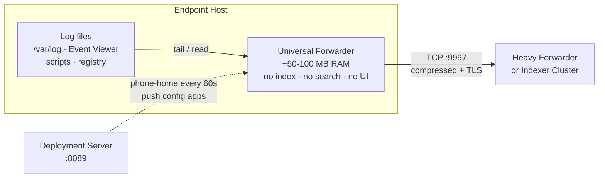
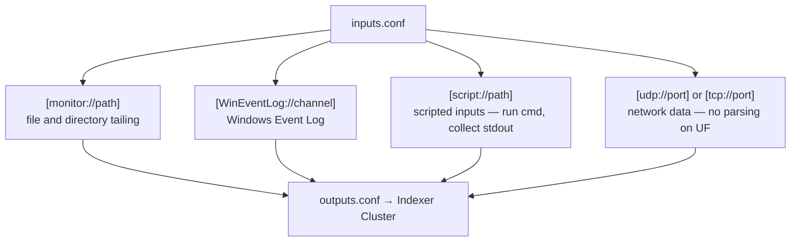
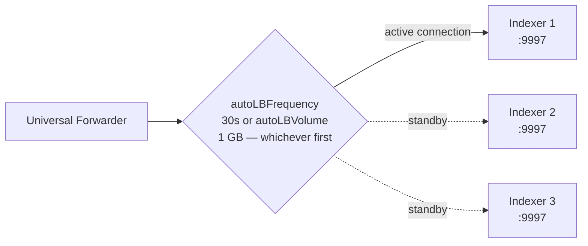
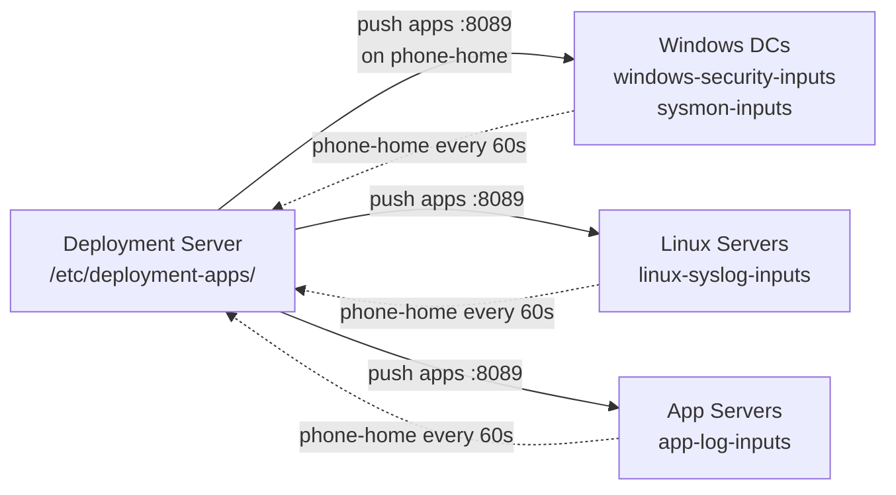
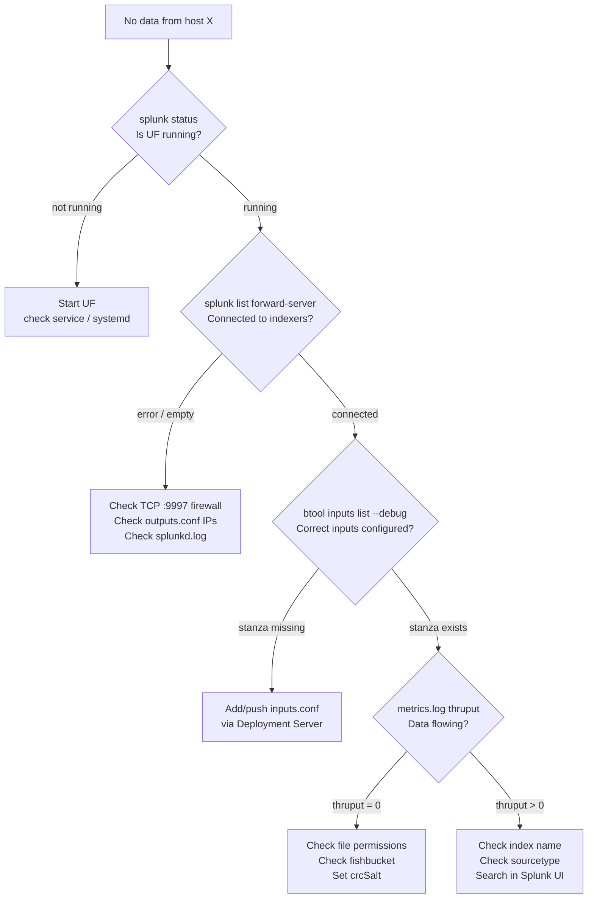

# 02a · Universal Forwarder (UF)

> **Core question this module answers:** What exactly is the UF, how do you install and configure it at enterprise scale, and how do you troubleshoot it when data stops flowing?

---

## Official Sources

| Document | What it covers | Link |
|----------|----------------|------|
| Install a Windows Universal Forwarder | Silent MSI install, GPO deployment, AGREETOLICENSE params | [InstallaWindowsuniversalforwarder](https://docs.splunk.com/Documentation/Forwarder/9.4.0/Forwarder/InstallaWindowsuniversalforwarderfromaninstaller) |
| Install a Linux/Unix Universal Forwarder | tar/rpm/deb install, splunkfwd user, boot-start | [Installanixuniversalforwarder](https://docs.splunk.com/Documentation/Forwarder/latest/Forwarder/Installanixuniversalforwarder) |
| Configure the UF using config files | inputs.conf, outputs.conf, deploymentclient.conf overview | [Configuretheuniversalforwarder](https://docs.splunk.com/Documentation/Forwarder/9.4.0/Forwarder/Configuretheuniversalforwarder) |
| Configure forwarding with outputs.conf | Target groups, load balancing, TLS settings | [Configureforwardingwithoutputs.conf](https://docs.splunk.com/Documentation/Forwarder/9.4.0/Forwarder/Configureforwardingwithoutputs.conf) |
| Monitor Windows Event Log data | WinEventLog stanzas, renderXml, start_from, channels | [MonitorWindowseventlogdata](https://docs.splunk.com/Documentation/Splunk/9.4.2/Data/MonitorWindowseventlogdata) |
| Configure deployment clients | deploymentclient.conf, phone-home interval, targetUri | [Configuredeploymentclients](https://docs.splunk.com/Documentation/Splunk/9.4.2/Updating/Configuredeploymentclients) |
| Configure load balancing | autoLBFrequency, autoLBVolume, target groups | [Configureloadbalancing](https://docs.splunk.com/Documentation/Forwarder/9.0.0/Forwarder/Configureloadbalancing) |
| Troubleshoot the Universal Forwarder | splunkd.log, fishbucket, connection errors | [Troubleshoottheuniversalforwarder](https://docs.splunk.com/Documentation/Forwarder/9.4.0/Forwarder/Troubleshoottheuniversalforwarder) |

---

## What Is the Universal Forwarder?

The UF is a purpose-built, stripped-down binary — **not** a full Splunk instance with features disabled, but a separate binary compiled without those components.



### What the UF can do

- Monitor files and directories (tail mode)
- Collect Windows Event Log channels (System, Security, Application, Sysmon, custom)
- Run scripted inputs (execute a script, capture stdout as events)
- Receive data on TCP/UDP ports
- Monitor Windows Registry changes
- Compress and TLS-encrypt before sending
- Phone home to Deployment Server for config updates

### What the UF CANNOT do

- Index data (no disk writes to Splunk databases)
- Run SPL searches
- Render a web UI (port 8000 unavailable)
- Parse syslog, CEF, LEEF, or any structured format
- Route events to different indexes based on content
- Apply `props.conf` / `transforms.conf` transformations

> Safe to run on Domain Controllers, production SQL servers, POS terminals — anywhere a full Splunk instance would be unacceptable.

---

## Installation

### Windows — Silent Install (enterprise / GPO)

```powershell
msiexec.exe /i splunkforwarder-9.4.0-x64-release.msi `
  AGREETOLICENSE=yes `
  SPLUNKUSERNAME=SplunkAdmin `
  SPLUNKPASSWORD=Ch@ng3d! `
  RECEIVING_INDEXER="idx1.corp.example:9997" `
  DEPLOYMENT_SERVER="ds.corp.example:8089" `
  /quiet
```

| Path | Location |
|------|----------|
| Install directory | `C:\Program Files\SplunkUniversalForwarder\` |
| Config files | `%SPLUNK_HOME%\etc\system\local\` |
| Logs | `%SPLUNK_HOME%\var\log\splunk\splunkd.log` |

### Linux / Unix — Tar Method

```bash
# Extract
tar -xvzf splunkforwarder-9.4.0-linux-x86_64.tgz -C /opt

# First-time start (accepts license, creates splunkfwd user as of 9.1)
/opt/splunkforwarder/bin/splunk start --accept-license --answer-yes

# Enable auto-start on boot
/opt/splunkforwarder/bin/splunk enable boot-start -user splunkfwd
```

| Path | Location |
|------|----------|
| Install directory | `/opt/splunkforwarder/` |
| Config files | `/opt/splunkforwarder/etc/system/local/` |
| Logs | `/opt/splunkforwarder/var/log/splunk/splunkd.log` |

> **Security note (9.1+):** The UF now runs as a dedicated least-privilege user `splunkfwd` — not `root`, not the same as the full Splunk `splunk` user.

---

## inputs.conf — What to Collect

The UF reads `inputs.conf` to know what data to collect. Four primary stanza types:



### File and Directory Monitoring — `[monitor://]`

```ini
# Tail a single log file
[monitor:///var/log/auth.log]
index = linux_security
sourcetype = linux_secure

# Tail an entire directory (recursive by default)
[monitor:///var/log/nginx/]
index = web
sourcetype = nginx_access
whitelist = \.log$          # only files ending in .log
blacklist = \.gz$           # skip compressed rotated logs

# Only collect NEW data written after this config is applied
[monitor:///opt/app/logs/]
index = app_logs
sourcetype = custom_app
followTail = 1
```

| Attribute | What it does |
|-----------|-------------|
| `index` | Destination index on the indexer |
| `sourcetype` | Data type label — affects parsing at the indexer |
| `disabled = true` | Disables input without removing the stanza |
| `whitelist` | Regex — collect only matching filenames |
| `blacklist` | Regex — skip matching filenames |
| `followTail = 1` | Ignore existing content, only collect new writes |
| `crcSalt = <SOURCE>` | Identify files by content CRC, not path — prevents re-read on rename |

### Windows Event Log — `[WinEventLog://]`

```ini
# Security channel (logons, privilege use, audit events)
[WinEventLog://Security]
index = windows_security
sourcetype = WinEventLog:Security
disabled = false
start_from = oldest
current_only = 0            # 0 = include existing historical events

# Sysmon — always use renderXml = true
[WinEventLog://Microsoft-Windows-Sysmon/Operational]
index = sysmon
sourcetype = XmlWinEventLog:Microsoft-Windows-Sysmon/Operational
disabled = false
renderXml = true            # CRITICAL: preserves all structured XML fields

# System and Application channels
[WinEventLog://System]
index = windows
sourcetype = WinEventLog:System

# DNS analytical channel
[WinEventLog://Microsoft-Windows-DNS-Server/Analytical]
index = dns
sourcetype = WinEventLog:DNS-Server-Analytical
```

> **`renderXml = true` is critical for Sysmon.** Without it, Splunk uses the Windows API text renderer which flattens events and drops structured XML fields — process GUIDs, parent process IDs, hashes, and command lines that detection rules depend on are lost.

### Scripted Inputs — `[script://]`

```ini
# Run a PowerShell script every hour, capture stdout as events
[script://.\bin\collect_inventory.ps1]
index = inventory
sourcetype = host_inventory
interval = 3600

# Linux: collect running process list every 5 minutes
[script:///opt/splunkforwarder/bin/scripts/ps_list.sh]
index = linux_ops
sourcetype = process_list
interval = 300
```

### Network Inputs — `[udp://]` and `[tcp://]`

```ini
# Accept raw data on UDP 514 — arrives completely unparsed
[udp://514]
index = syslog_raw
sourcetype = syslog
connection_host = ip        # use source IP as host value
```

> Pointing network gear syslog at a UF port is possible but the UF has no parsing engine. Raw syslog arrives as a single string. Route network device syslog to a **Heavy Forwarder** for proper parsing and index routing.

---

## outputs.conf — Where to Send Data



Load balancing switches after a time interval or data volume threshold — **not** per-event round-robin.

```ini
[tcpout]
defaultGroup = indexer_cluster

[tcpout:indexer_cluster]
server = idx1.corp.example:9997, idx2.corp.example:9997, idx3.corp.example:9997
autoLBFrequency = 30        # switch indexer every 30 seconds
autoLBVolume = 1073741824   # OR switch after 1 GB — whichever comes first

# TLS encryption (required in production)
useSSL = true
sslCertPath = $SPLUNK_HOME/etc/certs/forwarder.pem
sslRootCAPath = $SPLUNK_HOME/etc/auth/cacert.pem
sslVerifyServerCert = true
```

---

## Deployment via Deployment Server

At scale you never SSH into individual UFs to edit configs. The Deployment Server manages the fleet.



### deploymentclient.conf (lives on the UF)

```ini
[deployment-client]
phoneHomeIntervalInSecs = 60

[target-broker:deploymentServer]
targetUri = ds.corp.example:8089
```

Pre-bake this into the MSI installer (`DEPLOYMENT_SERVER=` param at install time) or distribute via Ansible/Puppet/SCCM so UFs self-register on first boot.

### Deployment App directory structure (on the DS)

```
$SPLUNK_HOME/etc/deployment-apps/
├── windows-security-inputs/
│   └── default/
│       └── inputs.conf         ← pushed to ServerClass: Windows_DCs
├── sysmon-inputs/
│   └── default/
│       └── inputs.conf         ← pushed to ServerClass: Sysmon_Hosts
└── linux-syslog-inputs/
    └── default/
        └── inputs.conf         ← pushed to ServerClass: Linux_Servers
```

---

## CLI Reference

```bash
# Basic operations
$SPLUNK_HOME/bin/splunk start
$SPLUNK_HOME/bin/splunk stop
$SPLUNK_HOME/bin/splunk restart
$SPLUNK_HOME/bin/splunk status

# Check which indexers this UF is sending to
$SPLUNK_HOME/bin/splunk list forward-server

# Manually add a receiving indexer (writes to outputs.conf)
$SPLUNK_HOME/bin/splunk add forward-server idx1.corp.example:9997

# Validate config files — the #1 debug tool
$SPLUNK_HOME/bin/splunk btool inputs list --debug
$SPLUNK_HOME/bin/splunk btool outputs list --debug

# Reload inputs without a full restart
$SPLUNK_HOME/bin/splunk reload
```

---

## Troubleshooting



### Key log files

| File | Location | What it tells you |
|------|----------|-------------------|
| `splunkd.log` | `$SPLUNK_HOME/var/log/splunk/splunkd.log` | Connection errors, parsing errors, restart events |
| `metrics.log` | `$SPLUNK_HOME/var/log/splunk/metrics.log` | Events/sec, throughput, queue depth |
| `fishbucket/` | `$SPLUNK_HOME/var/lib/splunk/fishbucket/` | Seek database — which files have been read and how far |

### Common failure scenarios

| Symptom | Likely cause | Fix |
|---------|-------------|-----|
| UF running, no data at indexer | Wrong IP/port in `outputs.conf` or firewall blocking TCP 9997 | `splunk list forward-server`, check `splunkd.log` |
| Data arriving, wrong index | `inputs.conf` missing `index =` | Edit `inputs.conf`, restart or reload |
| Duplicate events after host rename | Fishbucket mismatch — UF re-reads files from start | Set `crcSalt = <SOURCE>` in `inputs.conf` |
| UF not getting DS updates | Wrong DS address in `deploymentclient.conf` | Check `splunkd.log` for phoneHome errors, verify TCP 8089 |
| `btool` shows unexpected value | Config hierarchy conflict — `system/local/` overriding DS-pushed app | `btool --debug` shows which file wins |
| Sysmon events missing structured fields | `renderXml` not set to `true` | Set `renderXml = true` in the Sysmon WinEventLog stanza |

---

## Self-Check Questions

**Q1 — You deploy a UF on a Palo Alto management server. The firewall sends syslog to UDP 514 on that host. Should the UF receive it directly?**
No. The UF can listen on UDP 514 but has no parsing engine. Events arrive as raw text, losing all structured fields. Point firewall syslog at a **Heavy Forwarder**, which can parse CEF/LEEF and route to the correct index via `props.conf` and `transforms.conf`.

**Q2 — An analyst reports Sysmon events are missing `ParentProcessId` and `Hashes` fields. What is the likely cause?**
`renderXml = true` is missing from the `[WinEventLog://Microsoft-Windows-Sysmon/Operational]` stanza. Without it, Splunk uses the Windows text renderer which drops all structured XML fields. Set `renderXml = true` and restart the UF.

**Q3 — After pushing a new `inputs.conf` via Deployment Server, a UF is still collecting from the old path. What do you check first?**
Run `btool inputs list --debug` on the UF. If `system/local/inputs.conf` has the old stanza, it overrides the DS-pushed app. Remove the conflicting stanza from `system/local/` or explicitly disable the old input in the DS app.

**Q4 — After renaming a server, the UF starts sending duplicate events for files it already read. Why?**
The fishbucket stores `path → last read position`. A path change looks like a new file, so the UF starts from the beginning. Prevention: set `crcSalt = <SOURCE>` so Splunk identifies files by content fingerprint rather than path.

---

*Next: [02b · Heavy Forwarder (HF)](02b-heavy-forwarder.md)*
